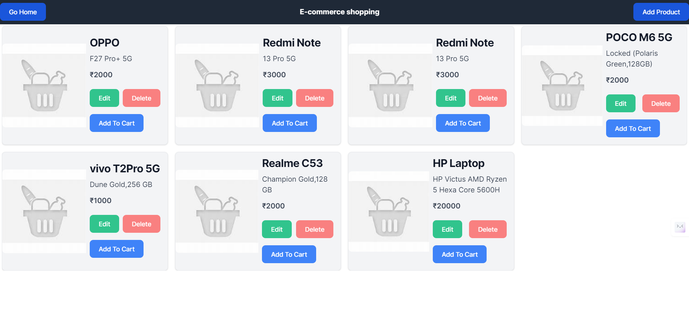
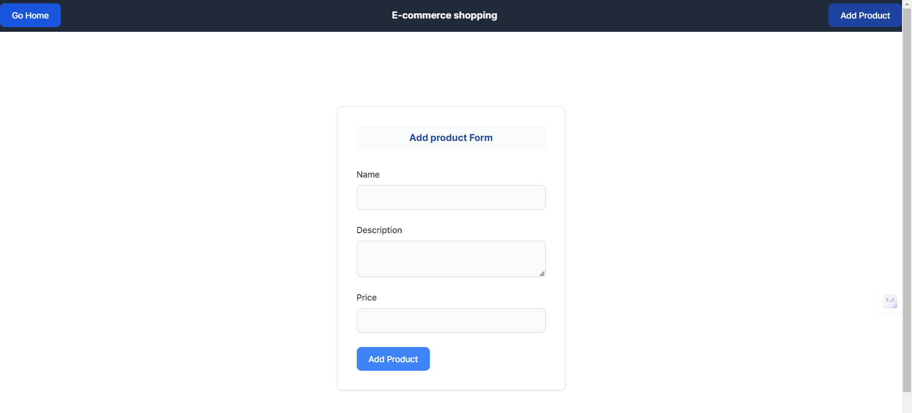
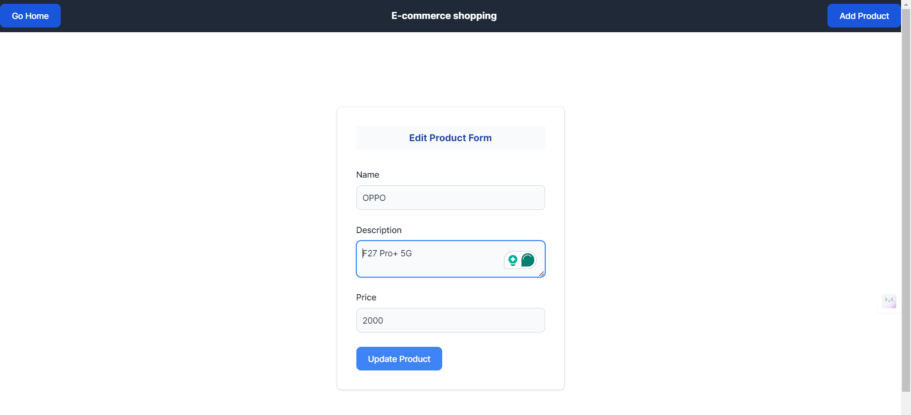
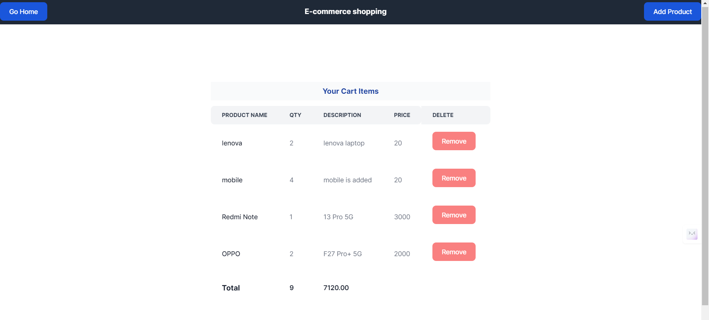

# Ecommerce App:

## Introduction
This project is a part of the Ecommerce App. The objective is to develop a web application based on the e-commerce using Astro.js and Tailwind CSS with Typescript. The project includes the implementation of various components such as Product Management and Shopping Cart Using Backend APIs.

## Requirements:
  Product Management:
        Add a new product.
        Update product details.
        Delete a product.
        Fetch product details.

  Shopping Cart:
        Add items to the cart.
        Remove items from the cart.
        View items in the cart.
        Update item quantities in the cart.

## Project Type
Frontend and Backend

## Deployed App
Frontend: [Live Demo](https://master--tiny-starburst-71af45.netlify.app/)
Backend: [Live Demo](https://shopping-cart-backend-three.vercel.app/)

## Features
**Tailwind CSS Implementation:** The project leverages Tailwind CSS for styling, ensuring rapid development and easy maintenance.

**Responsive Layout:** The layout is optimized for both mobile and desktop views, ensuring a seamless user experience across devices.

**Feature Implementation:** 

1. Product Management:
   - The application features a responsive and visually appealing Navbar with options to go to the home page and add a product. The product list is displayed on the home page. 
   - When the user clicks on "Add Product", a form is displayed to fill in the product details (name, price, description). After submitting the form, the product is successfully added and the user is redirected back to the home page. The updated product list is displayed.
   - If the user wants to edit a product, they can click on the "Edit" button. The edit form is displayed, allowing the user to modify the product details. After submitting the form, the product is successfully updated. The user is redirected back to the home page, and the updated product list is displayed.
   - To delete a product, the user can click on the "Delete" button. The product is deleted from the database using a backend API.

2. Shopping Cart:
   - After clicking the "Add to Cart" button for a product, the user is redirected to the shopping cart page. The items in the cart, including the quantity, are displayed.
   - To remove an item from the cart, the user can click on the "Remove" button. The item is removed from the cart in the database using a backend API.

Backend:
1. Test the API's in Postman:

**Product API's**

| Methods | API URL                                                         |
|---------|----------------------------------------------------------------|
|  GET     | https://shopping-cart-backend-three.vercel.app/api/product      |
|  POST    | https://shopping-cart-backend-three.vercel.app/api/product      |
|  PUT     | https://shopping-cart-backend-three.vercel.app/api/product/{id} |
| DELETE   | https://shopping-cart-backend-three.vercel.app/api/product/{id} |

**Cart API's**

| Methods | API URL                                                         |
|---------|----------------------------------------------------------------|
|  GET     | https://shopping-cart-backend-three.vercel.app/api/cart         |
|  POST    | https://shopping-cart-backend-three.vercel.app/api/cart         |
|  PUT     | https://shopping-cart-backend-three.vercel.app/api/cart/{id}    |
| DELETE   | https://shopping-cart-backend-three.vercel.app/api/cart/{id}    |
  
2. connect with Mongodb altas
3. create the model,controller,routes,utils to manage the database

    
## Design Decisions or Assumptions

**Tailwind CSS Selection:** Tailwind CSS is chosen for its utility-first approach, enabling quick prototyping and consistent styling across the application.

## Installation & Getting Started
To run the project locally, follow these steps:

### Clone the repository

    git clone https://github.com/Sravani0410/shopping-cart.git
    

### Navigate to the project directory

    Frontend:cd backend
    Backend: cd shoppingcart

### Install dependencies
 
   Frontend and Backend: npm install 

### Start the application

   Frontend: npm run dev
   Backend:npm start

## Usage

## Technology Stack

**Typescript:** TypeScript is a statically typed, free and open-source programming language developed by Microsoft. It is a superset of JavaScript, meaning it is fully compatible with existing JavaScript code and frameworks. TypeScript adds optional static typing and other features to improve the development experience.

**Astro.js:** Astro is the web framework for building content-driven websites like blogs, marketing, and e-commerce. Astro is best-known for pioneering a new frontend architecture to reduce JavaScript overhead and complexity compared to other frameworks. If you need a website that loads fast and has great SEO, then Astro is for you.

**Tailwind CSS:** A utility-first CSS framework for rapidly building custom designs.

**Backend:** Node,Express

**MongoDB Atlas:** To store the data in global cloud-based database service designed for developing modern applications.

**Deployment:** 
   Backend :   vercel,
   Frontend :  Netlify
---
