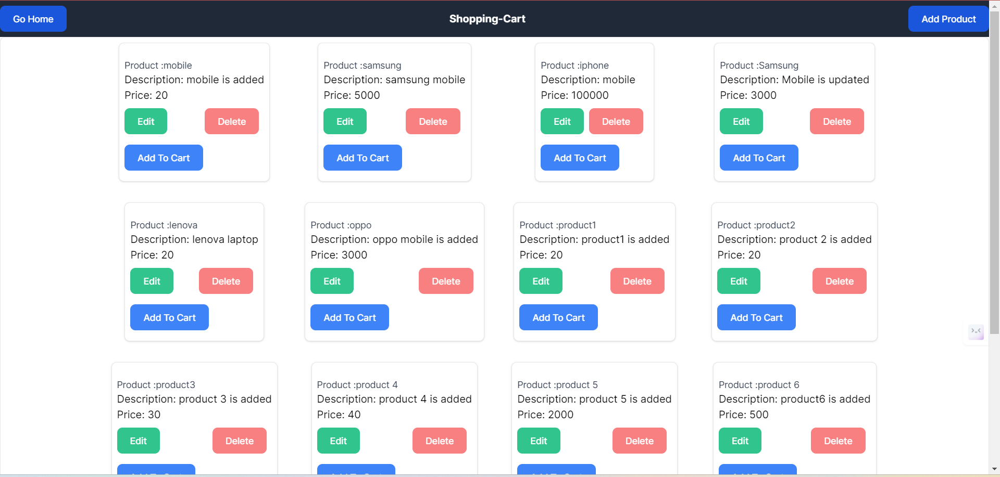
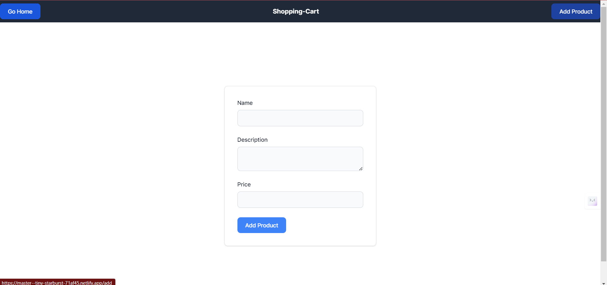
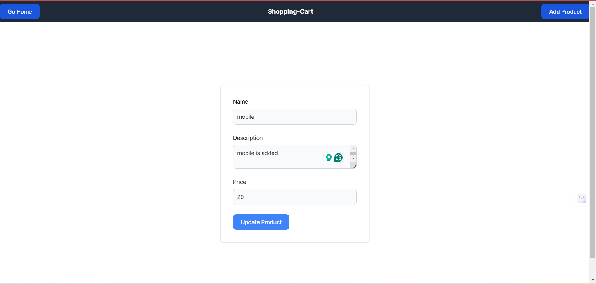
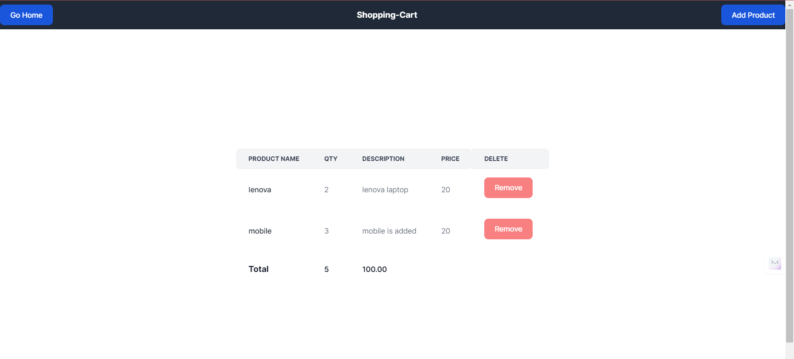

# Ecommerce App:

## Introduction
This project is a part of the Frontend and Backend App. The objective is to develop a web application based on the Ecommerce using Astro.js and Tailwind CSS with Typescript. The project includes the implementation of various components such as Product Management and Shopping Cart.

## Requirements:
  Product Management:
        Add a new product.
        Update product details.
        Delete a product.
        Fetch product details.

  Shopping Cart:
        Add items to the cart.
        Remove items from the cart.
        View items in the cart.
        Update item quantities in the cart.

## Project Type
Frontend and Backend

## Deployed App
Frontend: [Live Demo](https://master--tiny-starburst-71af45.netlify.app/)
Backend: [Live Demo](https://shopping-cart-backend-three.vercel.app/)

## Features
**Tailwind CSS Implementation:** The project leverages Tailwind CSS for styling, ensuring rapid development and easy maintenance.

**Responsive Layout:** The layout is optimized for both mobile and desktop views, ensuring a seamless user experience across devices.

**Feature Implementation:** 
Frontend:
1.  Product Management:
    The project a Navbar consists on Go Home, Add Product.product is showing.When we Click on Add Product it open form to fill name,price,description and submit the product after it will redirect to home page there all the product we can see.If we want to edit any product so click on edit it will open the edit form so after editing submit the form then it will successfully edited.if we want delete any product we can delete.
2.  Shopping cart:
     After click on add to cart button any product. it will redirect to cart page. there we can view items in the cart including with quantity. If we want remove any cart item. there is option to remove.

Backend:

1. Test the API's in Postman:
     Product: 
       GET: https://shopping-cart-backend-three.vercel.app/api/product
       POST: https://shopping-cart-backend-three.vercel.app/api/product
       PUT: https://shopping-cart-backend-three.vercel.app/api/produuct/id
       Delete:https://shopping-cart-backend-three.vercel.app/api/product/id
     Cart:
       GET: https://shopping-cart-backend-three.vercel.app/api/cart
       POST: https://shopping-cart-backend-three.vercel.app/api/cart
       PUT: https://shopping-cart-backend-three.vercel.app/api/cart/id
       Delete: https://shopping-cart-backend-three.vercel.app/api/cart/id
2. connect with Mongodb altas
3. create the model,controller,routes,utils to manage the database

    
## Design Decisions or Assumptions

**Tailwind CSS Selection:** Tailwind CSS is chosen for its utility-first approach, enabling quick prototyping and consistent styling across the application.

## Installation & Getting Started
To run the project locally, follow these steps:

### Clone the repository

    git clone https://github.com/Sravani0410/shopping-cart.git
    

### Navigate to the project directory

    Frontend:cd backend
    Backend: cd shoppingcart

### Install dependencies
 
   Frontend and Backend: npm install 

### Start the application

   Frontend: npm run dev
   Backend:npm start

## Usage

## Technology Stack

**Typescript:** TypeScript is a statically typed, free and open-source programming language developed by Microsoft. It is a superset of JavaScript, meaning it is fully compatible with existing JavaScript code and frameworks. TypeScript adds optional static typing and other features to improve the development experience.

**Astro.js:** Astro is the web framework for building content-driven websites like blogs, marketing, and e-commerce. Astro is best-known for pioneering a new frontend architecture to reduce JavaScript overhead and complexity compared to other frameworks. If you need a website that loads fast and has great SEO, then Astro is for you.

**Tailwind CSS:** A utility-first CSS framework for rapidly building custom designs.

**Backend:** Node,Express

**MongoDB Atlas:** To store the data in global cloud-based database service designed for developing modern applications.

**vercel:** To Deploy both Frontend and Backend

---